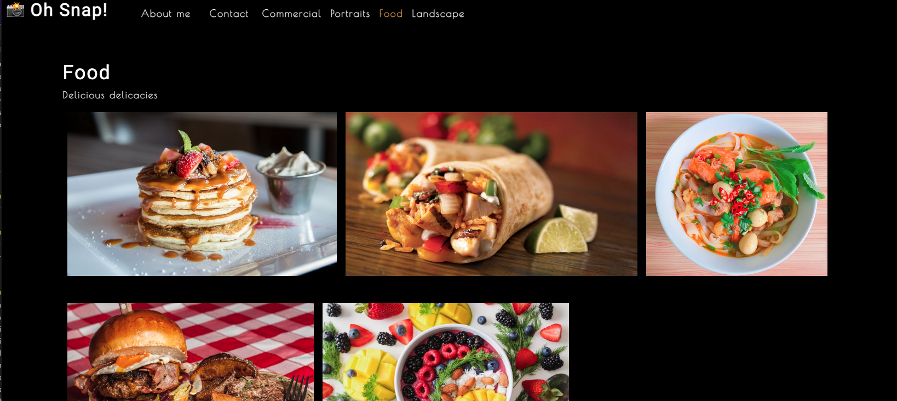

 # Images App 

  ## Description

 Customers can watch different images in different categories

  ## Table of Contents
  - [Description](#description)
  - [Installation](#installation)
  - [License](#license)
  - [Contributing](#contributing)
  - [Questions](#questions)

  ## Installation

  Packages installed are:   1. npm init   npm create react 

  ## License

  
This application is covered by the MIT license.

For more information on license types, please reference to this website for additional licensing information - [LICENSE INFORMATION](https://opensource.org/licenses).

  ## Contributing

  Satwinder Singh

  ## Questions?

  Feel free to contact me with example or any question via the information below:
 * Find me on Github:[satwinder191995](https://github.com/satwinder191995)
 * Email me with any questions: [satwinder47@outlook.com](mailto:satwinder47@outlook.com)

  ## Website design image
  

